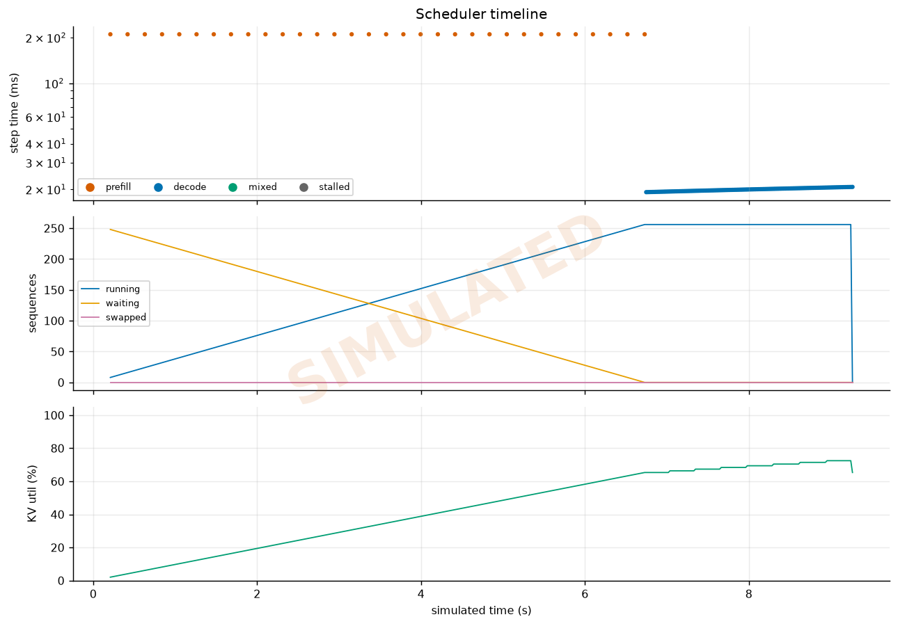

# 08 - Chunked Prefill Scheduler Experiment

> Long-context requests starve decode without scheduling control.

```bash
./experiment.py policy   --out results/   # the headline: on vs off
./experiment.py sweep    --out results/   # max_num_batched_tokens is the dial
./experiment.py timeline --out results/   # per-step traces, both policies
./experiment.py real --base-url http://localhost:8000    # live vLLM
```

## The problem

Without chunked prefill, vLLM's scheduler gives prefill absolute priority: if
any request is waiting and fits the token budget, the **entire step** is a
prefill step, and every running sequence decodes nothing for its duration.

A 16k-token prompt takes a few hundred milliseconds to prefill on an H100 for
an 8B model; a 32k prompt takes over a second. Every user already mid-generation
sees a gap of exactly that length between two tokens. Their TTFT was fine. Their
stream simply froze because somebody else pasted a document.

This is invisible in any benchmark that sends uniformly shaped requests, which
is most of them. Starvation is by definition one request class harming another,
so you cannot observe it without at least two classes in flight.

It shows up immediately in a scheduler trace. The figure below came from a
simulator run while building the reporting layer: 256 requests of 1024 tokens
each, submitted at once, `max_num_seqs=256`, prefill-priority scheduling. The
timeline shows **6.7 seconds of consecutive prefill steps before a single decode
step ran**, each prefill step taking ~210 ms:



The middle panel shows the running batch filling while the waiting queue drains,
and the top panel shows only orange (prefill) dots for the first two thirds of
the run. Every one of those 256 sequences was admitted, allocated KV, and then
left idle.

## What chunked prefill does

Prefill is split across steps and mixed with decodes in a single batch.
Crucially, decodes are admitted **first**, each consuming one token of the
budget, so they cannot be starved. Prefill chunks then fill whatever budget
remains.

In `llmkit/simulator/engine.py` the two policies are implemented side by side
in `_schedule()`, which is the clearest way to see the difference: the
prefill-priority branch returns `(prefills, [], ...)` with an empty decode list,
and the chunked branch subtracts `len(decodes)` from the token budget before
allocating any prefill work.

## The trade, which is real

Chunked prefill is not free. Smaller chunks protect ITL better and make TTFT
worse, because a long prompt now needs more steps to complete. The dial is
`max_num_batched_tokens`:

| Direction | Effect on interactive ITL | Effect on long-prompt TTFT |
|---|---|---|
| smaller budget | better (finer slicing, decode waits less) | worse (more steps to finish prefill) |
| larger budget | worse (approaches prefill-priority) | better |

`./experiment.py sweep` maps this curve. The useful setting is the smallest
budget that still keeps prefill throughput acceptable; below roughly 512 tokens
a growing fraction of each step is fixed per-step overhead (scheduler, sampling,
kernel launch) rather than useful work.

`--long-prefill-token-threshold` additionally caps how much of a *single*
request's prefill can run per step, which bounds the damage one enormous prompt
can do even when the global budget is large.

## Why the experiment reports request classes separately

`split_summaries()` reports the interactive and long-prompt requests as separate
summaries. Pooling them is what hides the effect: the chat requests are numerous
and the long ones are few, so a pooled ITL percentile is dominated by the very
requests whose stalls you are trying to measure, and the long requests'
different shape muddies the rest.

It also reports **worst single inter-token gap**, not just p99 ITL. A p99
averages the stall away across a long generation; the maximum gap is what a user
would describe as "it froze", and it is the number that moves most between the
two policies.

## Measuring it on real hardware

Start two vLLM instances differing only in the flag:

```bash
vllm serve meta-llama/Llama-3.1-8B-Instruct --port 8000 \
  --enable-chunked-prefill --max-num-batched-tokens 2048

vllm serve meta-llama/Llama-3.1-8B-Instruct --port 8001 \
  --no-enable-chunked-prefill
```

Then run `./experiment.py real` against each. The workload interleaves short
interactive prompts with occasional long ones, which is the part that matters:
a uniform load test will show almost no difference between these two servers and
you will conclude, wrongly, that the flag does nothing.

Watch `vllm:time_per_output_token_seconds` and the worst-gap number rather than
average throughput. Aggregate throughput is often slightly *lower* with chunked
prefill, because mixing phases is marginally less efficient per step. You are
buying latency predictability, not throughput, and a benchmark that only reports
tok/s will make chunked prefill look like a regression.

## Recent vLLM defaults

Chunked prefill is enabled by default in current vLLM for most configurations,
and the V1 engine's scheduler always mixes phases. The flag still matters
because the *budget* still matters, and because plenty of production
deployments are pinned to older versions or explicitly disable it after reading
a throughput-only benchmark. Setting it explicitly also makes the config
self-documenting, which is why `projects/01-inference-server/serve_vllm.sh`
passes it even where it is the default.
